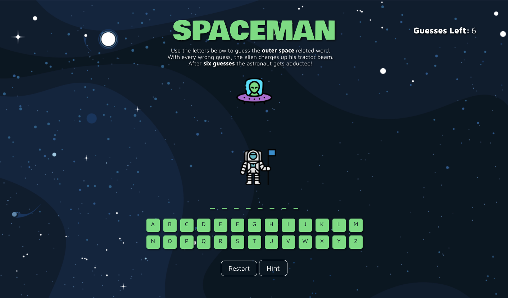
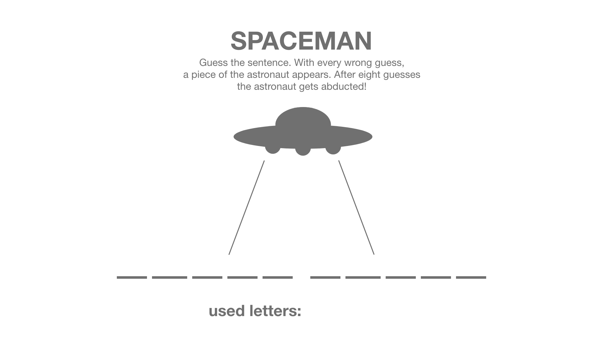

# SPACEMAN 
---
A outer-space themed browser game where the player guesses a word using letters and after six wrong guesses, the player loses - a twist on the classic [Hangman](https://en.wikipedia.org/wiki/Hangman_(game)). The project was made with HTML, CSS, and Javascript, where I utilized and explored DOM Manipulation. [Play SPACEMAN.](https://pages.git.generalassemb.ly/nealgarcia/spaceman/)

## Technologies and Resources Used
- HTML
- CSS
- Javascript
- Adobe XD (Wireframes)
- Adobe Stock (Graphical Assets)

## Approach Taken
I had a timeframe of one-week to complete this project. In order to make efficient use of my time, I outlined a Timeframe and prioritized the tasks I needed to complete.

| Task | Priority |
| ----------- | ----------- |
| HTML and CSS Layout | High |
| Game Functionality and Logic | High |
| Styling | Medium |
| Stretch Goals | Low |

I also planned the game's features by defining the Minumum Viable Product (MVP) and any Stretch Goals that I desired to pursue if time remained.

| MVP | Stretch Goals |
| ----------- | ----------- |
| See letters guessed | Clean, attractive UI |
| See guesses remaining | Animation |
| Input via keyboard | Sounds |
| Restart | Hints |
| Display win & loss | Multiple Words

## User Stories
I created user stories to get a stronger understanding and better perspective of the project's features from the eyes of a prospective user.
- As a player, I want to see what letters I've already guessed.
- As a player, I want to see how many guesses I have left.
- As a player, I want to be able to restart the game at any point.
- As a player, I want a clean, attractive UI.
- As a player, I want to be able to input the letter via keyboard.
- As a player, I want the program to check if my input is a letter and print an error if its not.

## Wireframes
To get a clear idea of the game's layout, interface, and functionality, I created low-fidelity wireframes using AdobeXD. 

**Initial Screen**

**Game Won**

**Game Loss**

During development, I decided to make several changes from the wireframes for better usability and user experience. These changes were to:

- Instead of keyboard input, display alphabet for player to click
- Instead of showing 'used letters:', the letter is greyed out when the player clicks it.
- Instead of a piece of the astronaut appearing after every guess, the tractor beam of the UFO increases in opacity.
- Restart button moved to bottom. 

## Problems Faced
The biggest setback that I faced was in regards to game functionality - specifically getting the spaces to update whenever the player guessed a correct letter. After a spending a day and a half trying out an idea, I took a step back, broke down the idea into a simpler one, and I went with that idea and iterated on it until it functioned as expected.

## Future Goals
- Add functionality for multiple words.
- Add sound and animation.
- Mobile Responsiveness

## Bugs
- After game loss or game won, player can keep clicking letters, resulting in the 'guesses left' to be negative.
- Wonky at smaller sizes.

